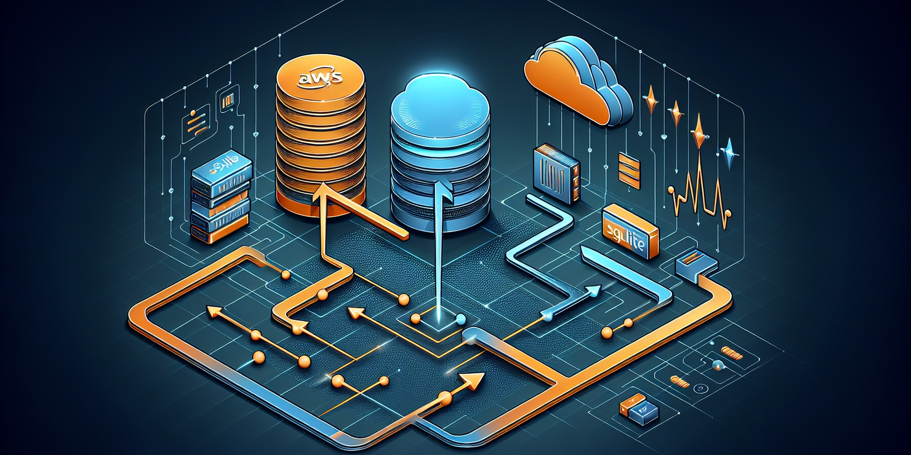

# DynamoDB Mirror

A high-performance service that mirrors DynamoDB tables to a local SQLite database with real-time streaming updates.

## Purpose

DynamoDB Mirror provides a lightweight, local copy of your DynamoDB tables stored in SQLite. It automatically discovers tables based on your stage configuration, performs an initial load, and keeps the local database synchronized with real-time changes through DynamoDB Streams.

## Installation

```bash
# Install dependencies
pip install -r requirements.txt
```

## Prerequisites

- Python 3.8 or higher
- AWS credentials configured with DynamoDB access
- Bosphorus middleware stage file at `~/work/bosphorus-middleware/.sst/stage`

## Usage

### Basic Usage

```bash
# Auto-discover and mirror all tables for your stage
./run

# Mirror with debug logging
./run --verbose
```

### Configuration Options

```bash
# Custom database location
./run --db-path /path/to/database.db

# Specify AWS region
./run --region us-west-2

# Adjust polling interval (higher = less resource usage)
./run --poll-interval 60   # Default: very low resource usage
./run --poll-interval 30   # Medium responsiveness
./run --poll-interval 5    # High responsiveness

# Mirror specific tables
./run --tables MyTable1 MyTable2

# Use original DynamoDB table names (no mapping)
./run --tables MyTable --no-mapping

# Disable entity-based views
./run --no-electro
```

### Validation and Testing

```bash
# Validate configuration and AWS credentials
./run validate

# Run test suite
./run test
```

## Examples

### Auto-Discovery (Recommended)

```bash
# Discovers all tables matching {stage}-bosphorus-* or {stage}-*
./run
```

If your stage is `daz3`, this automatically discovers and mirrors:
- `daz3-bosphorus-LendingTable` → `lending_table`
- `daz3-bosphorus-onboarding` → `onboarding`
- `daz3-bosphorus-platformConfig` → `platform_config`

### Specific Tables

```bash
# Mirror only lending and onboarding tables
./run --tables daz3-bosphorus-LendingTable daz3-bosphorus-onboarding

# Keep original table names
./run --tables MyProductionTable --no-mapping
```

### Different Environments

```bash
# Production with high responsiveness
./run --region us-east-1 --poll-interval 5

# Development with minimal resource usage
./run --poll-interval 120 --verbose
```

## Accessing Your Data

The mirrored data is stored in SQLite at `./output/dynamo_mirror.db` by default. Items are stored as JSON:

```bash
# Query with sqlite3
sqlite3 ./output/dynamo_mirror.db "SELECT json_extract(item_data, '$.id') FROM lending LIMIT 10"

# Or use any SQLite client
```

## Troubleshooting

### AWS Credentials

If you see credential errors:

```bash
# For AWS SSO users
aws sso login

# Then retry
./run validate
```

### Stage Configuration

Ensure your stage file exists:

```bash
cat ~/work/bosphorus-middleware/.sst/stage
```

### No Tables Found

If auto-discovery finds no tables:

```bash
# Check your AWS region
./run --region us-east-1 --verbose

# Or explicitly specify tables
./run --tables your-table-name
```